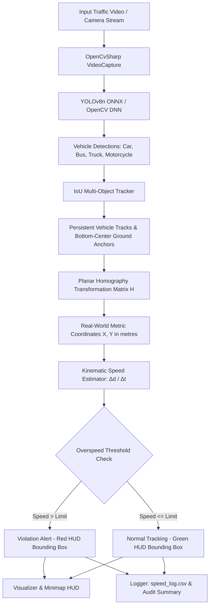

# CitizenRadar 🚗⚡

[](https://dotnet.microsoft.com/)
[](https://github.com/shimat/opencvsharp)
[](https://github.com/ultralytics/ultralytics)
[](#)
[](#)

**Monocular vehicle speed estimation, trajectory tracking, and school-zone traffic calming watchdog.**

---

## Overview

Excessive speeding through school zones and residential neighborhoods is a primary hazard in urban safety. Traditional police radar traps are infrequent, and commercial Doppler radar speed signs typically cost upwards of thousands of dollars.

**CitizenRadar** is a camera-based telemetry system designed to estimate vehicle velocities from a standard stationary video stream (e.g., traffic cameras, window-mounted webcams, or phone recordings). By combining deep-learning vehicle detection with planar homography calibration, the system rectifies camera perspective distortion and converts 2D pixel trajectories directly into real-world metric speeds ($km/h$).

> **Note**: This system provides optical speed *estimation* based on planar road approximations. It is designed for traffic monitoring, statistical audits, and safety reporting, rather than certified law-enforcement measurements.

---

## Pipeline Architecture



---

## Core Computer Vision Methodology

### 1. Planar Homography & Perspective Rectification

In a monocular perspective camera, objects of identical size appear smaller as distance increases. A vehicle moving at $50\text{ km/h}$ near the horizon covers only a few pixels per frame, whereas up close it spans dozens of pixels per frame.

To eliminate perspective distortion, CitizenRadar uses **Planar Homography** ($\mathbf{H}$). During an interactive calibration phase, the user selects four coplanar ground points on the roadway (e.g., pedestrian crossing stripes or lane markers) of known real-world width ($W$) and depth ($H$):

$$\begin{bmatrix} X_{\text{world}} \\ Y_{\text{world}} \\ 1 \end{bmatrix} \sim \mathbf{H} \begin{bmatrix} u_{\text{pixel}} \\ v_{\text{pixel}} \\ 1 \end{bmatrix}$$

where $\mathbf{H}$ is a $3 \times 3$ projective matrix calculated via OpenCV's `GetPerspectiveTransform`. Applying $\mathbf{H}$ warps image coordinates directly into real-world ground meters.

### 2. Ground-Plane Anchor Point Selection

Standard bounding box centroids $(\text{center}_x, \text{center}_y)$ float in 3D space at vehicle hood or roof height. Because homography assumes ground-plane planarity, projecting the center point causes severe perspective parallax. 

CitizenRadar strictly anchors each vehicle to its **bottom-center point**:
$$\mathbf{p}_{\text{anchor}} = \left( x + \frac{w}{2}, \; y + h \right)$$
This represents the tire-road contact plane where the homography transformation holds mathematically true.

### 3. Multi-Object Tracking (MOT)

Detections are associated across frames using an **Intersection-over-Union (IoU)** greedy bipartite matching strategy:
- Tracks maintain persistent IDs and historical trajectory coordinates $(t, u, v)$.
- Unmatched tracks enter a coasting state for up to $N$ frames to tolerate brief occlusions before deregistration.
- Newly appearing vehicles receive fresh monotonic IDs.

### 4. Velocity Calculation & Filtering

Velocity is evaluated over a sliding temporal window of frames ($\Delta N$):
1. The ground displacement $\Delta d$ in meters between position at frame $t$ and frame $t - \Delta N$ is evaluated:
   $$\Delta d = \sqrt{(X_t - X_{t-\Delta N})^2 + (Y_t - Y_{t-\Delta N})^2}$$
2. Given video frame rate $\text{FPS}$, elapsed time $\Delta t = \frac{\Delta N}{\text{FPS}}$.
3. Instantaneous metric speed:
   $$v_{\text{instant}} = \left( \frac{\Delta d}{\Delta t} \right) \times 3.6 \quad [\text{km/h}]$$
4. An Exponential Moving Average (EMA) smoother suppresses camera jitter and bounding-box flicker:
   $$v_t = \alpha v_{\text{instant}} + (1 - \alpha) v_{t-1}$$

---

## Project Structure

```text
CitizenRadar/
├── CitizenRadar.sln               # .NET 8 Visual Studio Solution
├── .gitignore                     # Git ignore for .NET, weights, and media
├── README.md                      # Project documentation and specifications
└── CitizenRadar/
    ├── CitizenRadar.csproj        # Project configuration & OpenCvSharp4 packages
    ├── Config.cs                  # Tunable thresholds, speeds, paths, colors
    ├── Program.cs                 # Main pipeline orchestration entry point
    │
    ├── Core/
    │   ├── Calibrator.cs          # Interactive 4-point homography calibration & JSON I/O
    │   ├── Detector.cs            # YOLOv8n ONNX inference & NMS via OpenCV DNN
    │   ├── Tracker.cs             # IoU-based multi-object tracker & track lifecycle
    │   ├── SpeedEstimator.cs      # Metric coordinate transformation & speed kinematics
    │   ├── Visualizer.cs          # Annotated video HUD, minimap, and overlay rendering
    │   └── Logger.cs              # CSV telemetry exporter and summary reporting
    │
    ├── Models/
    │   ├── Detection.cs           # Detection record (bbox, confidence, class, anchor)
    │   ├── Track.cs               # Track record (history, speed, violation status)
    │   └── CalibrationData.cs     # Calibration serialization schema
    │
    ├── models/                    # Directory for yolov8n.onnx (downloaded separately)
    ├── data/                      # Directory for calibration.json
    └── output/                    # Generated speed_log.csv & annotated output videos
```

---

## Technology Stack

| Layer | Component | Description |
|:---|:---|:---|
| **Platform** | .NET 8 (C# 12) | Modern, cross-platform runtime |
| **Computer Vision** | OpenCvSharp4 | Native C# bindings for OpenCV (video I/O, geometry, drawing) |
| **Model Inference** | OpenCV DNN Module | Direct execution of YOLOv8 ONNX without external runtimes |
| **Object Detection** | YOLOv8n (COCO) | Lightweight real-time detector (Cars, Motorcycles, Buses, Trucks) |
| **Serialization** | System.Text.Json | Structured JSON persistence for calibration parameters |
| **Telemetry Export** | System.IO.StreamWriter | High-throughput CSV logging of vehicle speeds |

---

## Getting Started

> 📖 **Team Setup Guides**:
> - 💻 **For Windows Teammates (5 members)**: Follow the **[Windows Setup Guide in SETUP.md](SETUP.md#-windows-setup-guide)** (or double-click `setup-windows.bat`).
> - 🐧 **For Fedora Linux**: Follow the **[Fedora Linux Setup Guide in SETUP.md](SETUP.md#-fedora-linux-setup-guide)** (or run `./setup-fedora.sh`).

### 1. Prerequisites

- [.NET 8.0 SDK](https://dotnet.microsoft.com/download/dotnet/8.0) or higher
- Git

### 2. Clone the Repository

```bash
git clone https://github.com/Abyyy-s/CitizenRadar.git
cd CitizenRadar
```

### 3. Restore Dependencies

```bash
dotnet restore
```

### 4. Prepare YOLOv8 ONNX Model

Export the standard YOLOv8 nano model to ONNX format (one-time setup):

```bash
pip install ultralytics
yolo export model=yolov8n.pt format=onnx imgsz=640
```

Place the resulting `yolov8n.onnx` file in `CitizenRadar/models/yolov8n.onnx`.

---

## Usage Guide

### Running with a Video Stream

```bash
dotnet run --project CitizenRadar/CitizenRadar -- <path_to_video.mp4>
```

Optional arguments:
```bash
dotnet run --project CitizenRadar/CitizenRadar -- <video_path> [model_path] [calibration_path]
```

### Interactive Calibration Workflow

1. If no saved `calibration.json` is provided, CitizenRadar displays the first frame of the video.
2. Click **4 points** on the planar road surface in clockwise order:
   - **Point 1**: Top-Left
   - **Point 2**: Top-Right
   - **Point 3**: Bottom-Right
   - **Point 4**: Bottom-Left
3. The console will prompt you to enter the ground dimensions of this quadrilateral:
   - Real-world road width ($W$) in meters
   - Real-world road length ($H$) in meters
4. CitizenRadar calculates $\mathbf{H}$, validates matrix condition, saves `calibration.json`, and starts tracking.

---

## Output Specifications

### 1. CSV Telemetry Export (`output/speed_log.csv`)

| Column | Type | Description |
|:---|:---|:---|
| `frame` | Integer | Frame index in the video |
| `track_id` | Integer | Unique persistent vehicle ID |
| `class_id` | Integer | COCO class index (2: Car, 3: Motorcycle, 5: Bus, 7: Truck) |
| `class_name` | String | Vehicle category name |
| `speed_kmh` | Float | Estimated ground speed in $km/h$ |
| `is_violation` | Boolean | True if speed exceeds configured speed limit |

### 2. Video HUD & Minimap

- **Bounding Box & Label**: Green for compliant speeds, bright red for overspeed violations.
- **Anchor Indicator**: Circular marker at the ground-contact point of each vehicle.
- **Bird's-Eye Minimap**: Top-down metric orthographic viewport showing dynamic real-world vehicle positioning.
- **Telemetry HUD**: Real-time traffic statistics (total vehicles, active count, violation percentage).

---

## License

This project is developed as an academic computer vision project. See LICENSE for details.
